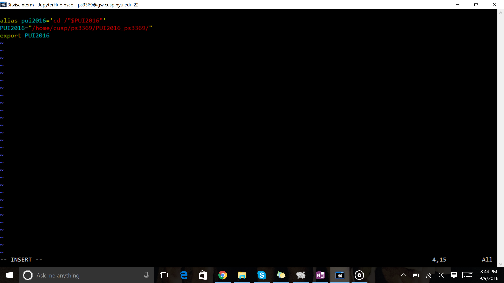

PUI 2016  Homework1 -by Priyanshi Singh
ASSIGNMENT1:  For assignment i took help from vishwajeet shelkar and worked together.He helped me in solving merge conflict.
steps:

1) I made a directory in my compute gittest and created a file myfirstfile.txt

2) Then i added this file to cloud by providing the address of the repository on cloud which i created online on github.

3) I made changes to the .txt file in my compute and pushed it to cloud.

4) I made changes to the .txt file online and saved to the respository.

5) again i tried to make a change in the .txt file where i got my merge conflict.

6) I pulled the .txt file, then edited, then added and commit to the cloud to solve the merge conflict.

7) Then i forked vishwajeet's repository and cloned it to enter in his repository.

8) Then i edited the .txt file in vishwajeet's repository and commit and push to the cloud.

9) Then i asked vishwajeet to create a pull request to embrace my changes. i accepted this request by going to my profile on cloud.

10) And finally i had the changes in .txt file.

ASSIGNMENT2:
Steps:
1) In .bash_profile 

    if [ -f ~/.bashrc ]; then 
        source ~/.bashrc
    fi
whenever terminal starts it goes to .bash_profile(it's a login shell) in which this code executes and take to .bashrc(non-login shell)

2) In .bashrc
used export to set the environment variable PUI2016 which is the path of the directory. To know the path of directory used 'pwd' command. 
    export PUI2016="/home/cusp/ps3369/PUI2016_ps3369
    
so that using $PUI2016 in console returned this path.

3) Setting alias
again in vi .bashrc, set the alias for environment variable, so that using the keyword pui2016 will directly take me in the directory.
    alias pui2016='cd /"$PUI2016"'
    
hence using pui2016 on console took directly in the directory.
    
    

Assignment3:i took help from Aaron to understand the concept of mean and deviatin. Then I used google to understand the syntax of color iteration and gone through the links as well to understand the gaussian distribution.

HELPED:
1) I helped Pooneh to understand the commands in github and with README file.

2) I helped  Akshay to understand the concept for environment variable and .bashrc files essence.
      
